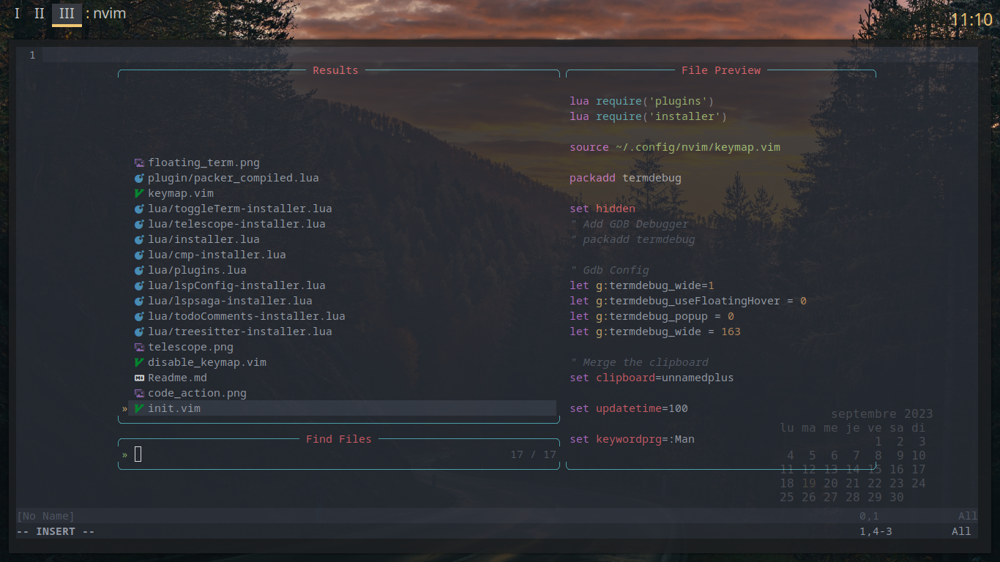
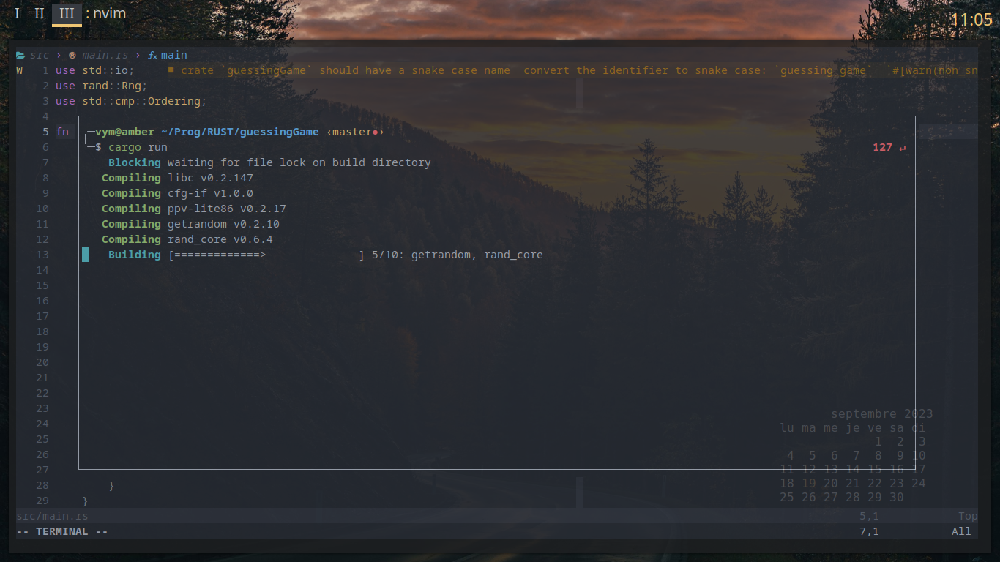
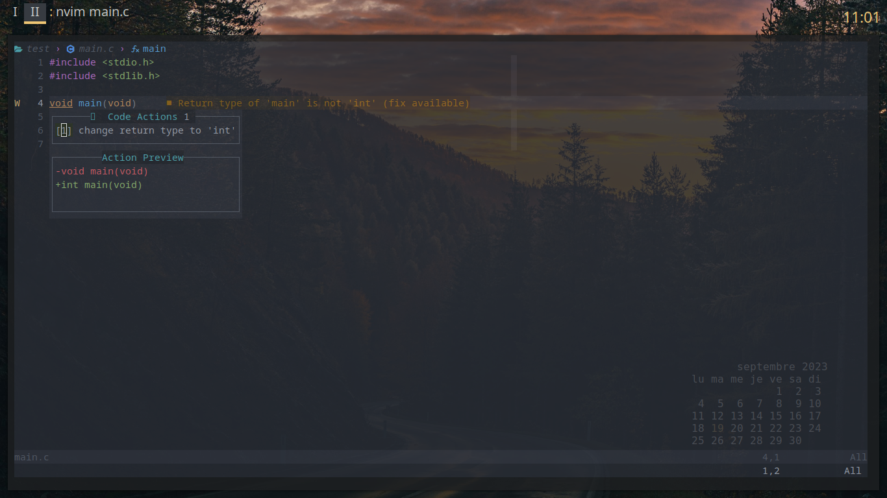

# Nvim Install SM

Le but de ce repo est d'installer cette config nvim en Salle Machine.

## How to Install

```
git clone https://github.com/MrVyM/Nvim-Install-SM.git ~/.confs/
cd ~/.confs
mv install.sh install_backup.sh
mv Nvim-Install-SM/install.sh .
mkdir ~/.confs/config/nvim  -p
cp Nvim-Install-SM/* config/nvim -rf
./install.sh
```

### Explication
Le nouveau fichier **install.sh** contient 2 choses importantes.

Le code qui va installer neovim ainsi que ses dependance.

Et une commande qui demander à Nvim d'update les plugins (via Packer)


## KeyMap Help

La fichier de **keymap.vim**

#### RTFM
> Maj+k : Launch le man de la fonction qui est sur votre curseur

#### Telescope
> Alt+o : ouvre Telescope



> Alt+f : Ouvre Telescope en mode recherche de chaine de caractere

#### Le saint Graal
> "noremap ; :" : remap le ; en : en mode normal

#### Onglet
Pour les onglets, j'utilise la meme keymap que Firefox
> Alt+Nombre : Va a l'onglet X

> Alt+t : New Onglet

> Alt+w : Close Onglet 

> Alt+h : Previous Onglet

> Alt+l : Next Onglet

#### Floating Terminal
> Alt+Enter : Toogle un terminal dans vim


Utile pour ceux qui aime faire du Rust

#### Code Action
> ? : Lance la box de code action



### Option Interesante
Lancer une Preview en temps reel d'un fichier Markdown dans le navigateur
Utile pour faire des Readme.
> :MarkdownPreview

Rename un fichier sans sortir de Nvim
> :Rename new_name
Cela vient du plugin Sugar/Unix (lire :help eunuch pour plus de fonction) 

Git Wrapper
> :G add .

> :G commit 

Je ne vous fait pas l'affront de vous expliquer GIT

## Pour les curieux
La liste des plugins utilisé

    -- Git wrapper
    use 'tpope/vim-fugitive'

    -- Telescope
    use 'nvim-lua/plenary.nvim' 
    use 'nvim-telescope/telescope.nvim'
    use 'BurntSushi/ripgrep'
    use 'nvim-treesitter/nvim-treesitter' 

    -- Color RGB
    use 'norcalli/nvim-colorizer.lua'
    
    -- Icons Fonts
    use "kyazdani42/nvim-web-devicons"

    -- LSPconfig
    use "neovim/nvim-lspconfig"
    use "hrsh7th/cmp-nvim-lsp" 
    use "williamboman/mason.nvim"
    use "williamboman/mason-lspconfig.nvim"
    use 'hrsh7th/nvim-compe' 
    use 'simrat39/rust-tools.nvim'
    use 'hrsh7th/nvim-cmp' 
    use({
        "L3MON4D3/LuaSnip",
        tag = "v2.*", 
        run = "make install_jsregexp"
    })  
    use "honza/vim-snippets"
    use 'nvimdev/lspsaga.nvim'

    -- Colorscheme
    use 'navarasu/onedark.nvim'
    use 'ray-x/aurora'
    use 'kristijanhusak/vim-hybrid-material' 
    
    -- Markdown Viewer
    use({
        "iamcco/markdown-preview.nvim",
        run = function() vim.fn["mkdp#util#install"]() end,
    })

    -- Toogle Term
    use {"akinsho/toggleterm.nvim", tag = '*', config = function()
        require("toggleterm").setup()
    end}

    -- Todo Comments
    use 'folke/todo-comments.nvim' 

    -- Sugar Unix
    use 'tpope/vim-eunuch' 

